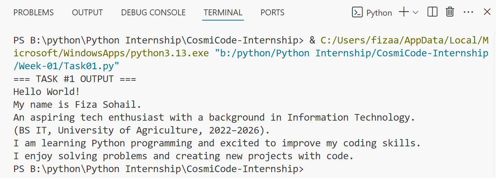
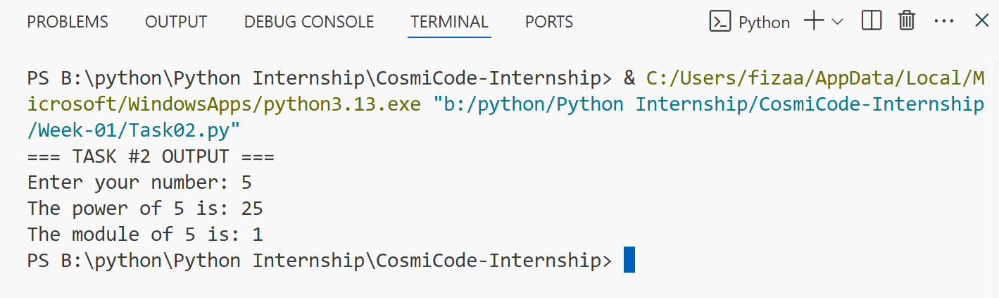
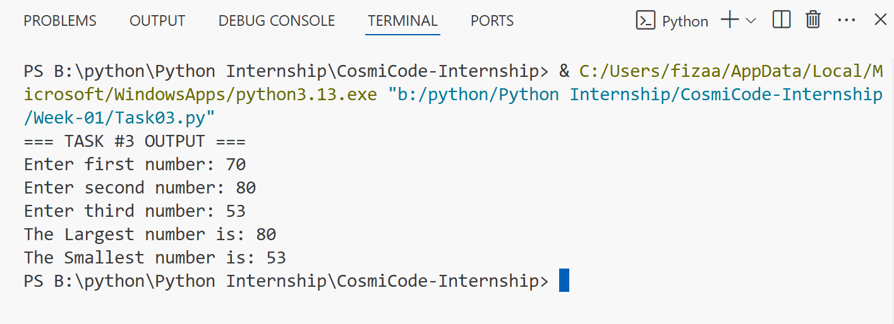
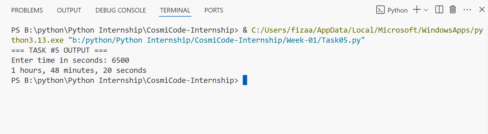

# 🐍 Python Internship – Week 01 Tasks

Hi! This folder includes all the tasks I completed in **Week 01** of my Python internship. The goal this week was to practice basic Python concepts like printing messages, taking input, using functions, doing calculations, and understanding conditionals.

## 📘 Task Details

### 🔹 Task 1: Hello World & Intro

A simple program that prints **"Hello, World!"** and a short introduction about me.
It's my first step into Python programming!

### 🔹 Task 1: OUTPUT 

### 🔹 Task 2: Advanced Arithmetic

This program performs two operations:

* **Power** (using `**`)
* **Modulo** (using `%`)

Both are done using **custom functions**, just to get used to how functions work in Python.

### 🔹 Task 2: OUTPUT 

### 🔹 Task 3: Find Largest & Smallest Number

The user enters three numbers.
The program finds and prints:

* The **largest**
* The **smallest**

This task helped me understand how built-in functions like **min()** and **max()** work in Python.

### 🔹 Task 3: OUTPUT 

### 🔹 Task 4: Area of Shapes

This one calculates the area of:

* A **trapezoid**
* An **ellipse**

I used math formulas and the `math` module (for pi). Great for applying logic and math in code.

### 🔹 Task 4: OUTPUT 

### 🔹 Task 5: Time Converter

This program takes a time value in **seconds** and converts it to:

* **Hours**
* **Minutes**
* **Seconds**

It was a fun challenge using `//` and `%` operators.

### 🔹 Task 5: OUTPUT 

# Week 01 was a great start. ✅
# I learned the basics of Python and got comfortable with functions, input/output, and built-in methods.

