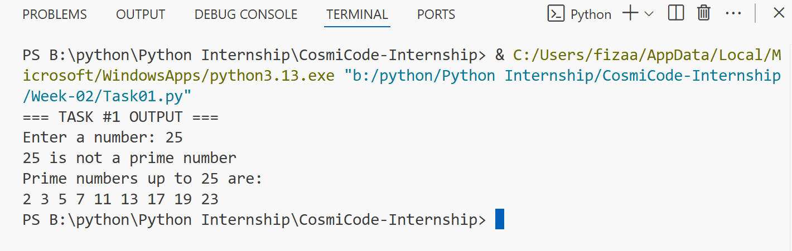
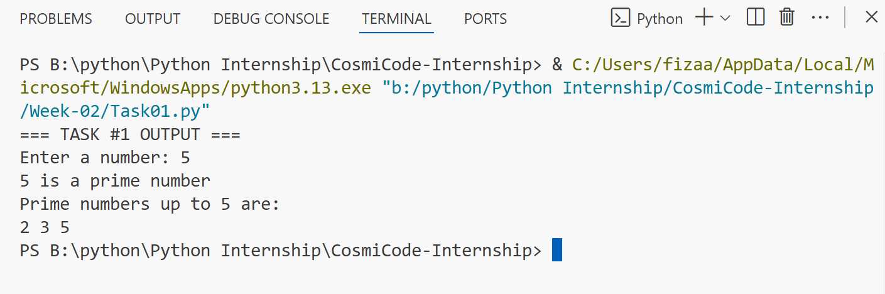
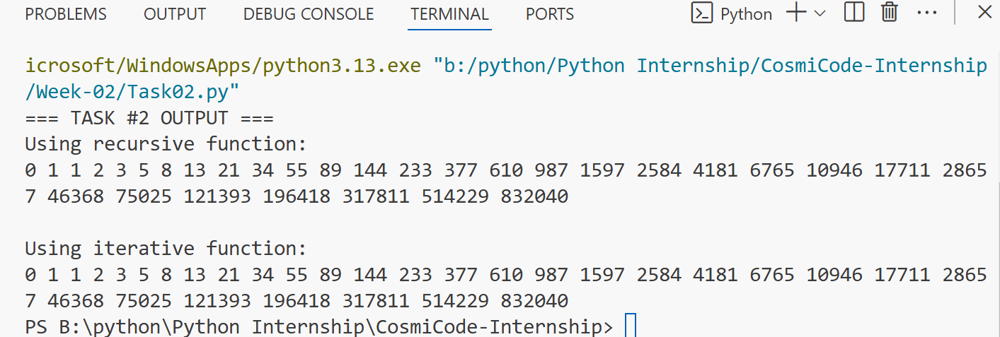
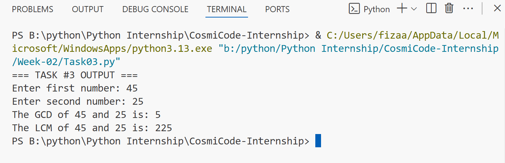
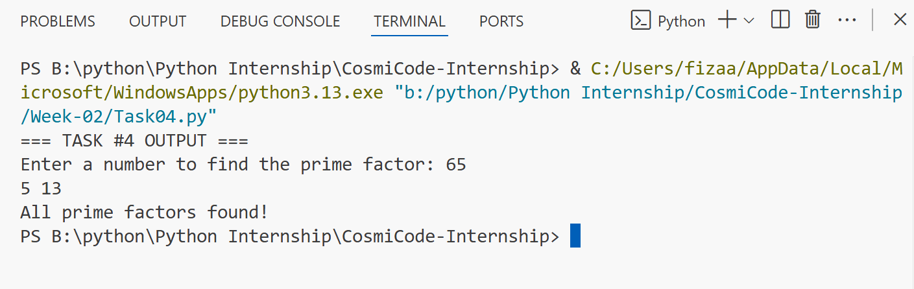
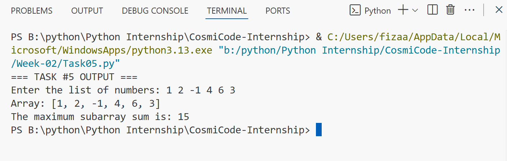

# 🐍 Python Internship – Week 02 Tasks

This folder contains all the tasks I worked on in **Week 02** of my Python internship.  
This week was focused on **logic building, mathematical problem-solving, and learning new algorithms** in Python.

## 📘 Task Details

### 🔹 Task 1: Prime Number Checker & List

A program that:
- Checks whether a given number is **prime**.
- Prints **all prime numbers** up to that number.

This task helped me understand loops, divisibility checks, and conditional logic.

### 🔹 Task 1: OUTPUT

### 🔹 Task 2: Fibonacci Sequence (Iterative & Recursive)

Generates the **first 30 Fibonacci numbers** in two ways:
1. **Iterative** → using loops.
2. **Recursive** → using function calls.

It was a good way to compare performance and logic between both methods.

### 🔹 Task 2: OUTPUT

### 🔹 Task 3: GCD & LCM Calculator

A program with a function that:
- Calculates the **Greatest Common Divisor (GCD)** using the **Euclidean Algorithm**.
- Calculates the **Least Common Multiple (LCM)** using the formula:
  **( x*y ) // gcd(x, y)**
This strengthened my understanding of math functions in Python.

### 🔹 Task 3: OUTPUT

### 🔹 Task 4: Prime Factors Finder

Finds all **prime factors** of a given number.

It combined concepts of prime checking and factorization, which was a good logical exercise.

### 🔹 Task 4: OUTPUT 

### 🔹 Task 5: Maximum Subarray Sum (Kadane's Algorithm)

Uses **Kadane’s Algorithm** to find the **subarray with the maximum sum** from a given list.

This was my first introduction to an **optimization algorithm** in Python — very useful for competitive programming.

### 🔹 Task 5: OUTPUT 

## 📅 Week Summary
# Week 02 was all about applying **mathematics** in Python and improving **algorithmic thinking**.  
I learned:
- Prime numbers and factorization
- Fibonacci sequence logic
- GCD & LCM calculations
- Kadane’s algorithm for optimization

## ✅ Level Up from Week 1!
