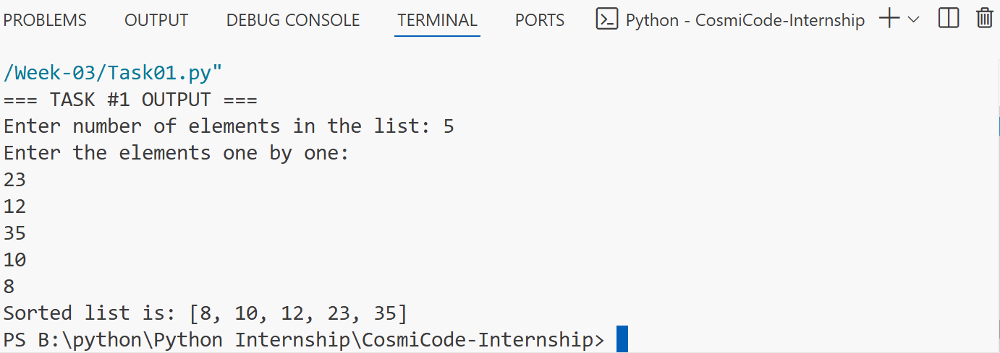
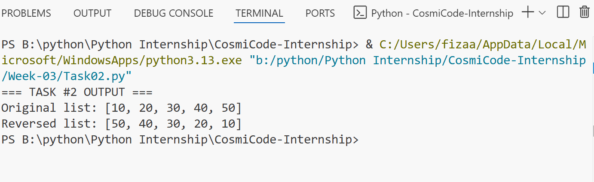
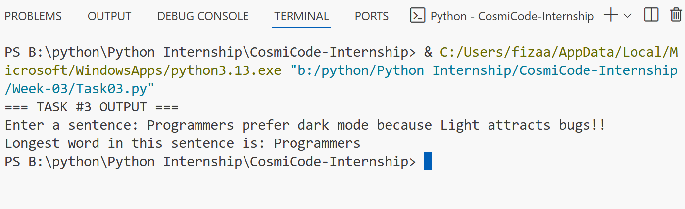
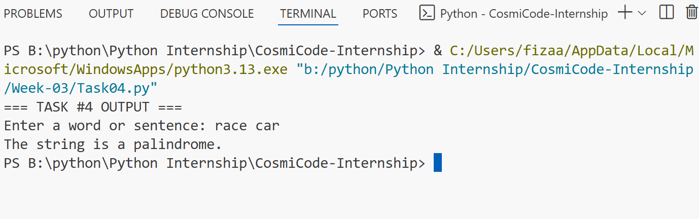
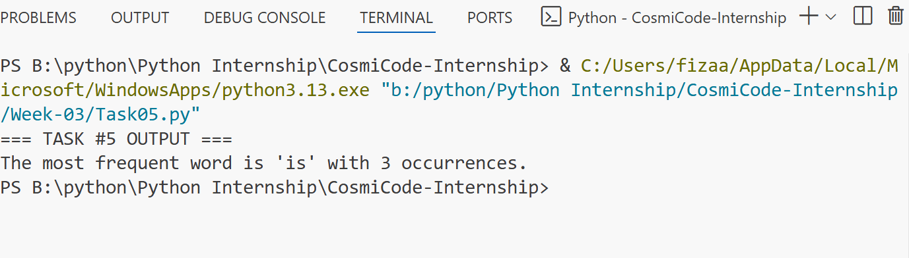

# 🐍 Python Internship – Week 03 Tasks

Hello there! 👋 This folder contains all the tasks I worked on in **Week 03** of my Python internship.
This week’s focus was on **sorting algorithms, list manipulation, string processing, and file handling**.

## 📋 Tasks Details

### 🔹 Task 1: Merge Sort

* Wrote a program to **sort a list of integers** using the **Merge Sort** algorithm.
* Implemented the **divide-and-conquer** technique to split and merge lists.

## 🔹 Task 1: OUTPUT

### 🔹 Task 2: Reverse List (Without Built-in Functions)

* Created a program to **reverse a list manually**, without using `reverse()` or slicing.
* Displayed **both original and reversed lists**.
* I learned how to use loops and index manipulation to reverse a list without any built-in functions, which helped me understand how lists are stored and accessed.

## 🔹 Task 2: OUTPUT

### 🔹 Task 3: Longest Word in a Sentence

* Developed a program that finds the **longest word** in a sentence entered by the user.
* **Ignored punctuation** to ensure accurate word detection.

## 🔹 Task 3: OUTPUT

### Task 4: Palindrome Checker

* Implemented a program to check if a string is a **palindrome**, ignoring spaces and case sensitivity.
* Used string cleaning techniques for comparison.

## 🔹 Task 4: OUTPUT

### Task 5: Most Frequent Word in a Text File

* Wrote a program to read a text file and find the **most frequent word**.
* Used the `collections.Counter` module for efficient word frequency calculation.

## 🔹 Task 5: OUTPUT

## 📅 Week Summary
## Week was all about improving problem-solving skills through **sorting algorithms, list manipulation, and text processing** in Python.
I learned:
- How merge sort works using recursion and divide-and-conquer
- Reversing a list manually without built-in functions
- Cleaning text and finding the longest word
- Checking for palindromes while ignoring spaces and cases
- Reading and writing files and finding the most frequent word

## 🚀 Another Step Forward in My Python Journey!