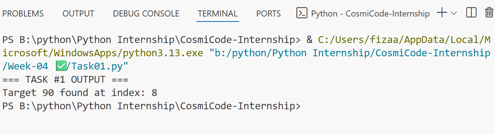
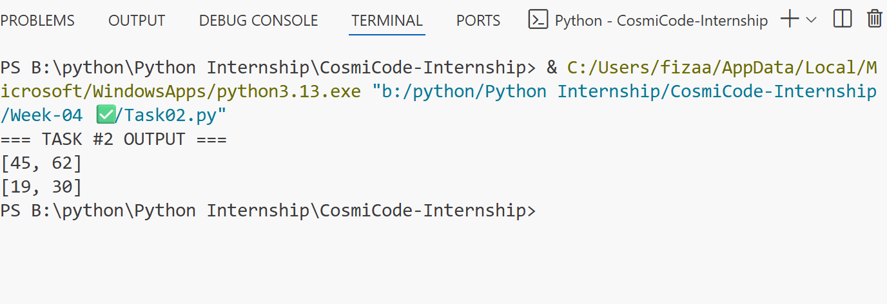
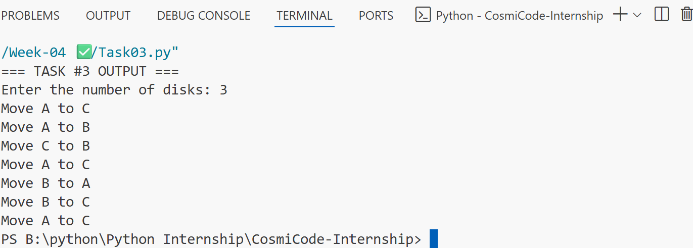
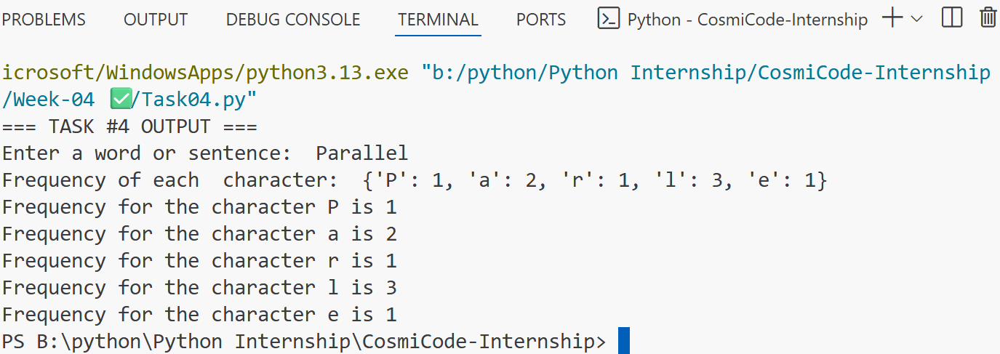
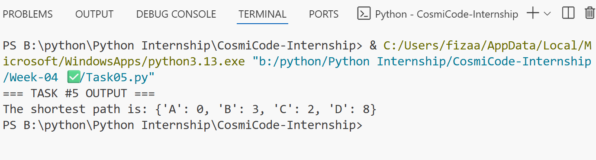

# 🐍 Python Internship – Week 04 Tasks

This folder contains all the tasks I completed in **Week 04** of my Python internship.
This week’s focus was on **advanced algorithms, recursion, data structures, and graph-based problem-solving.**

## 📋 Task Details

### 🔹 Task 1: Binary Search

* Implemented the Binary Search algorithm to efficiently find the position of a target value in a sorted list.
* Practiced the divide-and-conquer approach for faster searching.

## 🔹 Task 1: OUTPUT

### 🔹 Task 2: Matrix Multiplication

* Created a program to perform matrix multiplication on two given matrices.
* Learned how to work with nested loops and multi-dimensional lists.

## 🔹 Task 2: OUTPUT

### 🔹 Task 3: Tower of Hanoi (Recursion)

* Solved the Tower of Hanoi puzzle using a recursive approach.
* Understood how recursion breaks a complex problem into smaller steps.

## 🔹 Task 3: OUTPUT

### 🔹 Task 4: Character Frequency Counter

* Understood the meaning of frequency by writing a program to count the frequency of each character in a string using a Python dictionary.
* Practiced iterating over strings and storing results in key–value pairs.

## 🔹 Task 4: OUTPUT

### 🔹 Task 5: Dijkstra’s Algorithm (Shortest Path in a Graph)

* Implemented Dijkstra’s algorithm to find the shortest path between nodes in a graph.
* Learned about priority queues and how weights affect path selection.

## 🔹 Task 5: OUTPUT

## 📅 Week Summary
## This week was all about **binary search**, **matrix multiplication**, **recursion**, **character frequency counting**, and shortest path finding with **Dijkstra’s algorithm** in Python.
I learned:
- How binary search improves search efficiency
- Matrix multiplication using nested loops
- Solving recursive problems like Tower of Hanoi
- Using dictionaries to count occurrences of characters
- Applying Dijkstra’s algorithm to find shortest paths in graphs

## 🚀 Another Level Unlocked in My Python Journey! 🎯