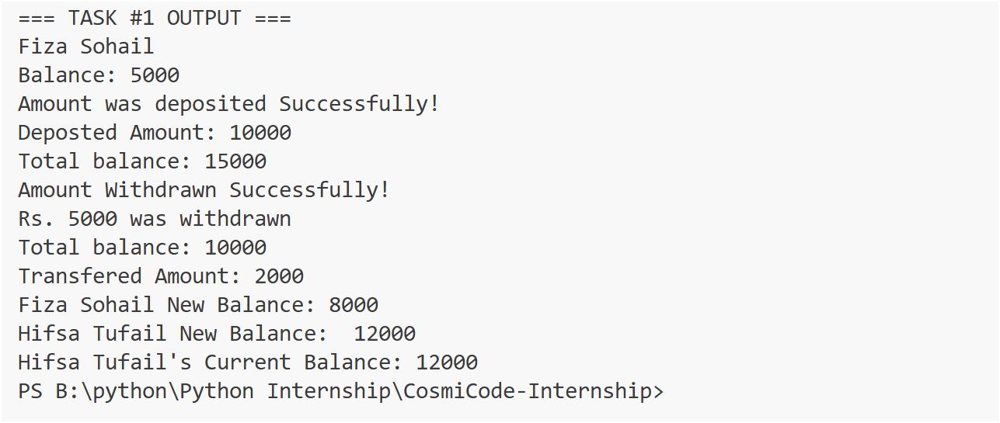
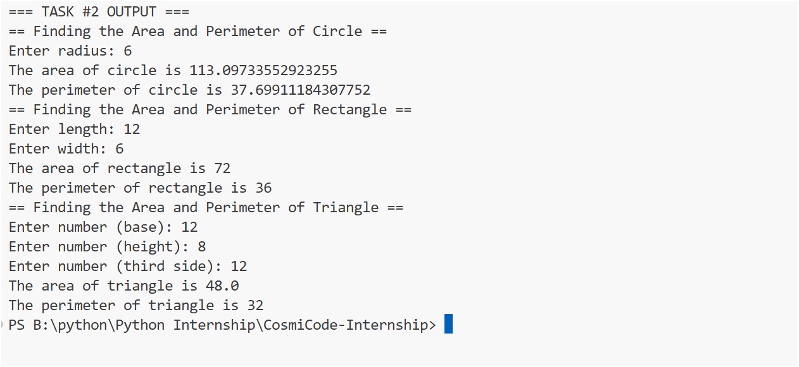
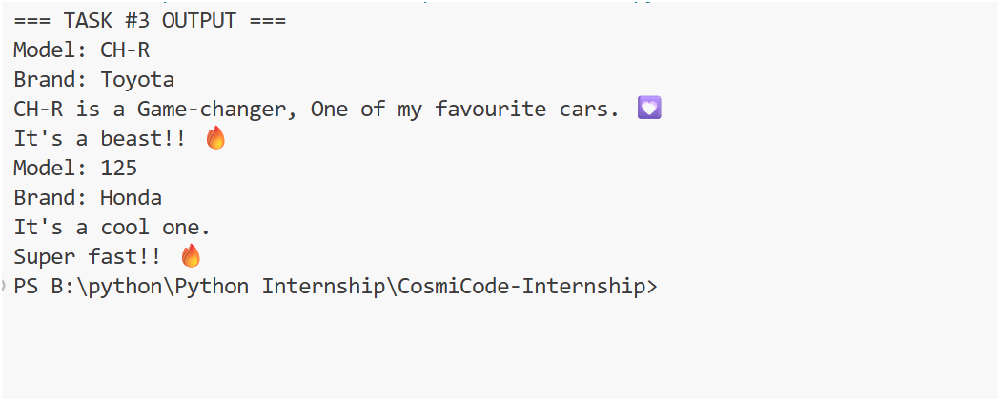
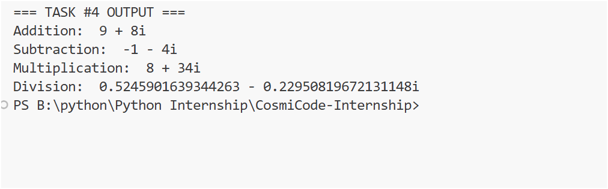
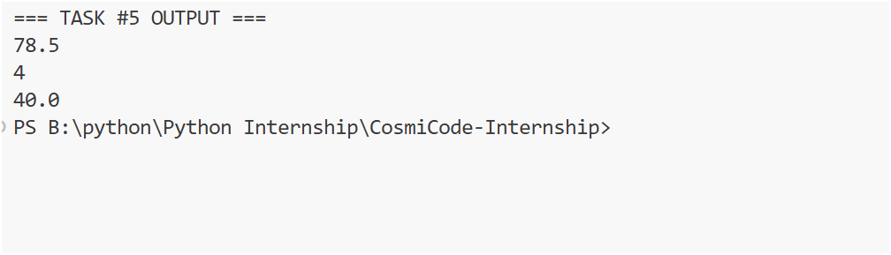
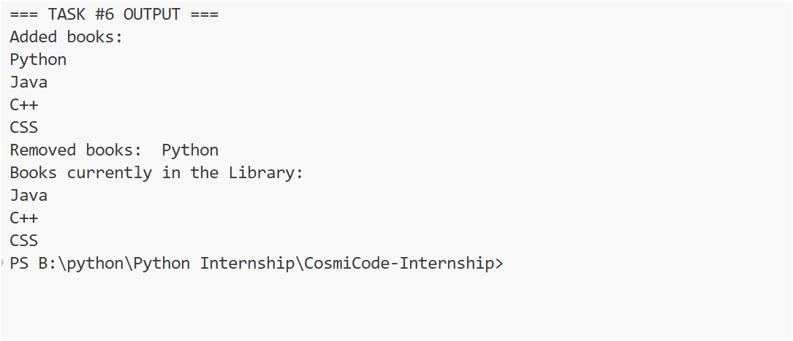
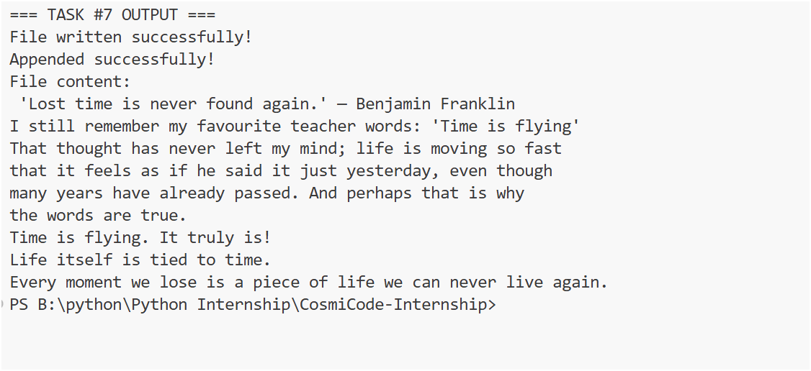

# 🐍 Python Internship – Week 05 Tasks

This folder contains all the tasks I completed in **Week 05** of my Python internship.
This week’s focus was on **Object-Oriented Programming (OOPs)** concepts in Python, **including classes**, **inheritance**, **polymorphism**, **operator overloading**, and **file handling**.

## 📋 Task Details

### 🔹 Task 1: Bank Account (Classes & Objects)

* Defined and used classes and objects to model a bank account.
* Implemented deposit, withdrawal, and balance methods.

## 🔹 Task 1: OUTPUT

### 🔹 Task 2: Geometric Shapes (Inheritance)

* Created a class hierarchy for geometric shapes.
* Calculated area and perimeter for different shapes.

## 🔹 Task 2: OUTPUT

### 🔹 Task 3: Vehicles (Inheritance)

* Implemented a base class Vehicle and derived classes for Car and Bike.
* Demonstrated reusability of code through inheritance.

## 🔹 Task 3: OUTPUT

### 🔹 Task 4: Complex Numbers (Operator Overloading)

* Implemented operator overloading to handle addition of complex numbers.
* Practiced customizing operators for user-defined classes.

## 🔹 Task 4: OUTPUT

### 🔹 Task 5: Polymorphism

* Demonstrated polymorphism using base and derived classes.
* Implemented method overriding to change behavior in child classes.

## 🔹 Task 5: OUTPUT

### 🔹 Task 6: Library Management System

* Built a Library System using classes.
* Implemented file handling to add, remove, and display books.

## 🔹 Task 6: OUTPUT

### 🔹 Task 7: File Handling with Classes

* Implemented file operations **(read, write, append)** using classes.
* Practiced file handling with OOP structure.

## 🔹 Task 7: OUTPUT

## 📅 Week Summary
## This week was all about **Object-Oriented Programming** in Python.
I learned:
- How to create and use classes & objects
- Building class hierarchies with inheritance
- Polymorphism and method overriding
- Operator overloading for user-defined objects
- Practical file handling with classes

## ✨ Building Stronger Foundations in Python – Week by Week! 📘