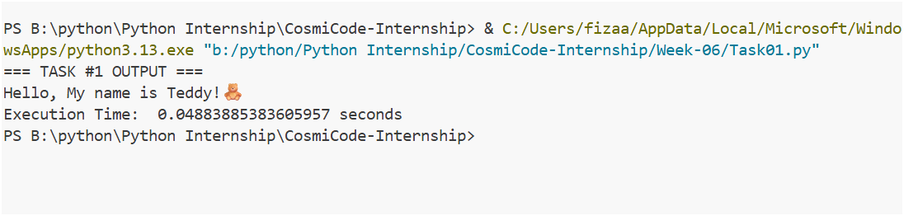
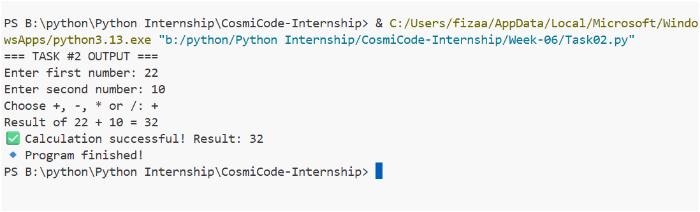
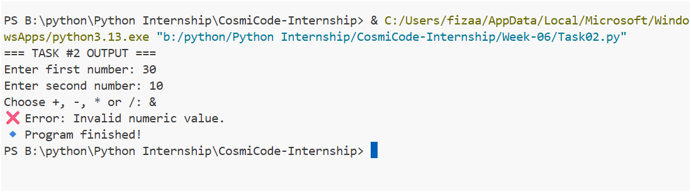
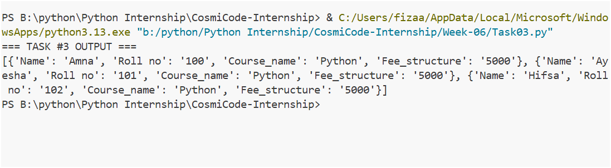
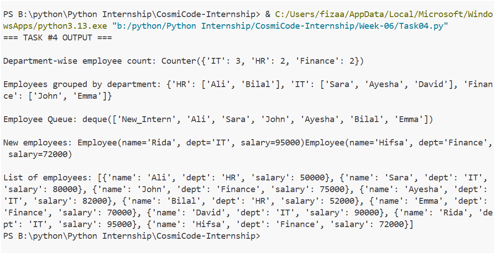
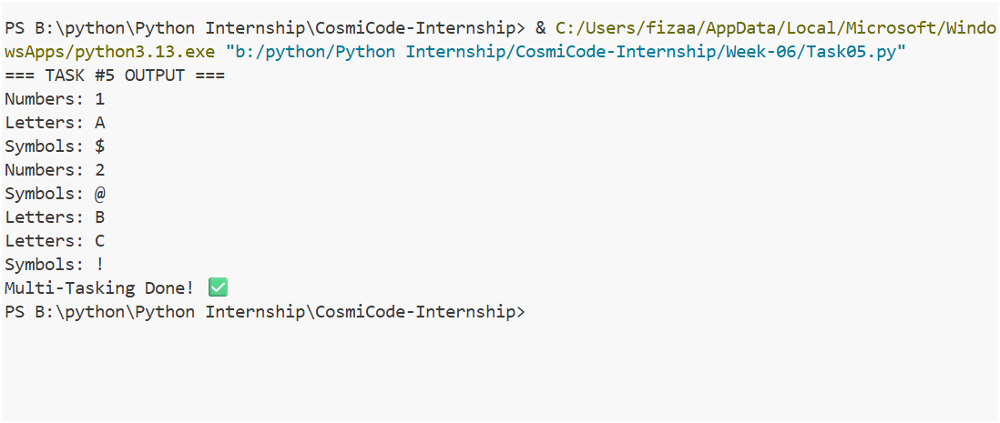
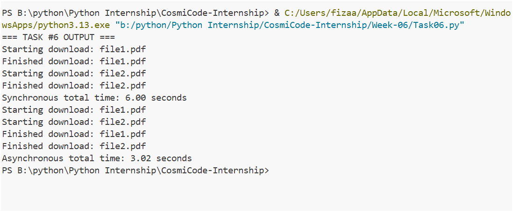
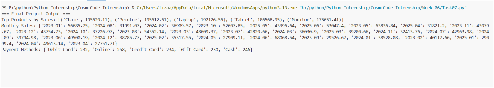
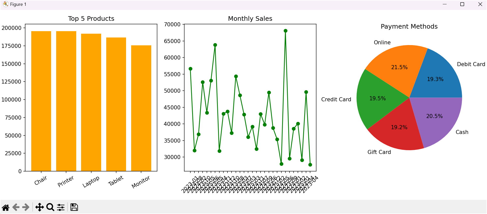

# 🐍 Python Internship – Week 06 Tasks

In Week 06 of my Python internship, I focused on advanced Python concepts like **decorators**, **exception handling**, **JSON**, **collections**, **multithreading, asyncio**, and finally applied everything in a complete **data analysis project**.

## 📋 Task Details

### 🔹 Task 1: Decorators – Execution Time

* Implemented a decorator function to measure execution time of another function.
* Learned how decorators add extra functionality without changing the function’s code.

## 🔹 Task 1: OUTPUT

### 🔹 Task 2: Exception Handling – Mathematical Calculations

* Wrote a program for complex mathematical operations.
* Used try-except to handle errors like division by zero and invalid input.

## 🔹 Task 2: OUTPUT

### 🔹 Task 3: JSON Handling

* Created a program to read from and write to JSON files.
* Understood how JSON is used for storing and transferring structured data.

## 🔹 Task 3: OUTPUT

### 🔹 Task 4: Collections Module

* Explored Python’s collections module for data manipulation.
* Practiced with Counter, defaultdict, etc. for handling structured data.

## 🔹 Task 4: OUTPUT

### 🔹 Task 5: Multithreading

* Built a program that runs multiple threads simultaneously.
* Learned how concurrency improves efficiency for tasks.

## 🔹 Task 5: OUTPUT

### 🔹 Task 6: Asyncio – Asynchronous I/O

* Implemented asynchronous I/O using Python’s asyncio.
* Practiced writing async functions for faster execution in I/O operations.

## 🔹 Task 6: OUTPUT

### 🔹 Task 7: Final Project – Data Analysis Application

* Developed a complete data analysis application.
** Steps included:
* Reading input data from CSV
* Processing product sales, months, and payment methods
* Visualizing with matplotlib (bar & pie charts)
* Exporting results into CSV files
* I used matplotlib because it gave me easy convenience and I am learning libraries step by step, so this helped me build a clearer understanding.

## 🔹 Task 7: OUTPUT

## 📅 Week Summary
## This week was about advanced Python programming and combining all concepts into a single project.
I learned:
- Writing reusable code with decorators
- Handling errors safely
- JSON file handling
- Data manipulation using collections
- Concurrency with multithreading and asyncio
- Building a complete data analysis project with visualizations and exports

## 🔚 Final Thoughts
## Although I still have much to learn, completing these tasks step by step has given me a solid foundation. Each week built on the previous one, and now I am ready to continue advancing my Python skills further.

